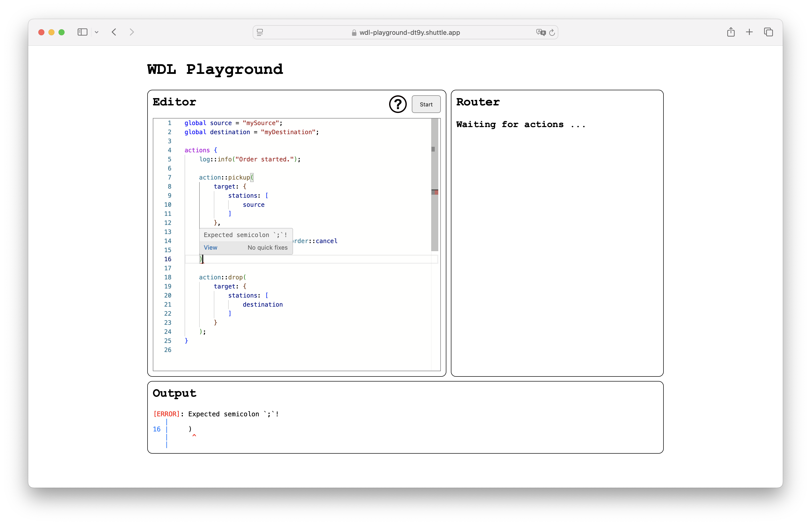
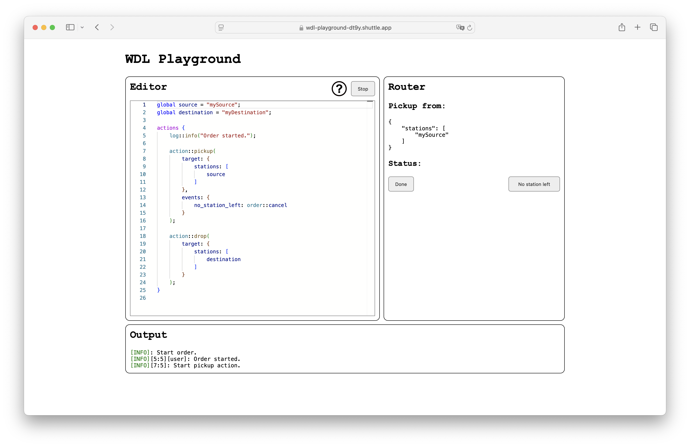

# Workflow Definition Language (WDL)

**This project was developed as part of my bachelor's thesis and is therefore not open for contributions.**

Workflow Definition Language (WDL) is a domain-specific language tailored for mobile robotics. Its semantics are based on the pi-calculus, introducing interesting features such as concurrent execution and synchronization channels. Moreover, it supports well-known concepts from other languages like JSON compatible values, global and local variables, functions, operators, and control structures like if-else statements and while loops.

In addition to its core functionality, WDL provides a comprehensive standard library. This library offers functions to perform physical actions like pickup and drop actions, accessing the web through HTTP calls, using regex for searching, finding, and replacing strings, and many more.

## Interpreter

The key component of this repository is the interpreter, fully written in Rust. The interpreter, along with other tools for its use, is provided as libraries. All source files for these components can be found in `crates/`.

## CLI

For using the language locally the CLI can be used to check and start workflows. There is also a subcommand for emulating the router inside the terminal.

### Requirements

The only requirement is the [Rust](https://www.rust-lang.org/) toolchain, including `cargo`, and permission for port `3003` on `0.0.0.0` for the gRPC communication between the interpreter and the router.

### Usage

The CLI can be used with `cargo run`. Currently, the CLI supports 3 subcommands:

- `check`: Checks if the syntax of a program is valid.
  - e.g. `cargo run -- check examples/station2station.wdl`
- `run`: Checks the program and if it's valid, runs it.
  - e.g. `cargo run -- run examples/station2station.wdl`
- `router`: Can be used to simulate the router, which executes the actions physically.
  - e.g. `cargo run -- router`

## Playground

In addition to the CLI, we provide a web playground for writing and testing workflows. The playground leverages the [Monaco Editor](https://github.com/microsoft/monaco-editor) for editing workflows, WASM for providing parser checks inside the browser while writing code, and WebSockets for testing workflows with an interpreter instance in the back end.

The playground showing an error because of a missing semicolon:  

The playground during the execution of a workflow and waiting for user input:  

To run locally or deploy the server you need the shuttle cli (`cargo install cargo-shuttle`) and run one of the following shell scripts:

- Run: `./start-playground.sh`
- Deploy: `./deploy-playground.sh`

## Language Support

For easier usage, we provide a minimal [Visual Studio Code](https://code.visualstudio.com/) extension that offers syntax highlighting for the source files. All source files for this extension can be found in `vscode-extension/`. For easy usage, we provide an NPM command, just run `npm run deploy` inside the `vscode-extension/` folder. Alternatively, the source files can be copied to `~/.vscode/extensions/wdl-lang-support/` manually. After deploying the extension, Visual Studio Code must be restarted.

## Language Documentation

Details on the language design and standard library can be found in the language documentation. This is provided by an [mdbook](http://rust-lang.github.io/mdBook/). All source files can be found in `doc/`.

### Requirements

The only requirement is the `mdbook` CLI, which can be installed with `cargo install mdbook`.

### Usage

To open the book in your browser, just run `mdbook serve --open` inside of `doc/`.
